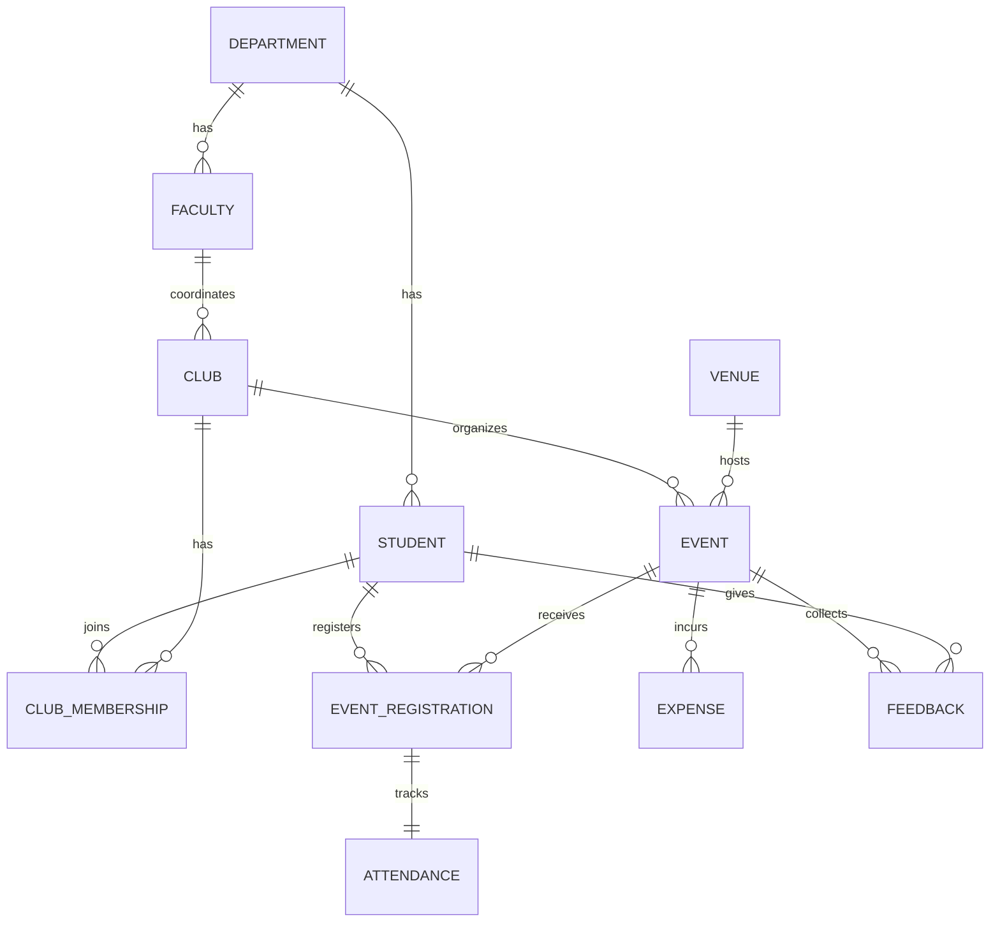

# Campus Event & Club Management System

A relational database (MySQL/MariaDB) for managing college clubs and the events they run — memberships, event scheduling, registrations, attendance, budgets, and feedback — with the rules enforced by the database itself, not just application code.

**Live project site:** https://shreshthsharma-os.github.io/DBMS_Project_CampusEvent_and_Club_Management_System/
**Course:** Database Management Systems (CSE3001) · **Faculty:** Vijendra Singh Bramhe · VIT Bhopal University

## Team

| Name | Registration No. |
|---|---|
| Shreshth Sharma | 25BCE11231 |
| Aryan Singh Patel | 25BCE11138 |
| Krish Salaria | 25BCE11158 |
| Harshvardhan Swami | 25BCE11122 |

## What This Project Is :

Clubs typically track events across spreadsheets, Google Forms, and chat groups. That leads to predictable problems: venues get double-booked, students register twice for the same event, nobody has an accurate attendance record, and event spending isn't checked against the approved budget until it's too late.

| File | What it is |
|---|---|
| 📄 `Campus_Event_Club_Management_System_Report.docx` | The full write-up — objectives, ER diagram, table-by-table breakdown, and how everything was normalized |
| 🗄️ `campus_event_club_management.sql` | The MySQL 8 schema and sample database, including app fields and stored objects |
| 🧭 `docs/er-diagram.mmd` | Editable Mermaid ER diagram for all entities and relationships |
| 🧪 `tests/constraint_checks.sql` | SQL checks for budget/capacity rules, registration, and automatic attendance |
| 🌐 `index.html`, `styles.css`, `script.js` | Responsive project overview website with repository and deliverable links |
| 🐍 `app.py`, `templates/index.html`, `requirements.txt` | Flask event listing, student sign-in, registration, cancellation, and profile application |
| 📘 `README.md` | You are here |
This project replaces that with a single normalized database where those problems are prevented by the schema itself — a duplicate registration is rejected, an over-budget expense is rejected, and an over-capacity venue booking is rejected, all at the point of insertion.

## What's in This Repo :

The static project overview links to the GitHub repository and the SQL, report, ER diagram, and constraint-check files. It is informational: it does not connect to a database or accept registrations.

**Run locally:** from the repository root, start Python's built-in static web server:

```sh
python -m http.server 8000
```

Then open <http://localhost:8000> in a browser. Stop the server with `Ctrl+C`.

**Publish on GitHub Pages:** in the repository, open **Settings → Pages**. Under **Build and deployment**, select **Deploy from a branch**, choose `shreshthsharma-os-create-dbms-deliverables` as the branch and `/(root)` as the folder, then select **Save**. After GitHub finishes its first deployment, the site will be available at:

<https://shreshthsharma-os.github.io/DBMS_Project_CampusEvent_and_Club_Management_System/>

The repository is public. A Pages URL is only live after Pages has been enabled and its deployment has completed; check the **Settings → Pages** page for deployment status or URL if GitHub has not published it yet.
| File | Description |
|---|---|
| `Campus_Event_Club_Management_System_Report.docx` | Full project report: objectives, ER diagram, data dictionary, normalization explanation, implementation notes |
| `campus_event_club_management.sql` | The complete MySQL script — schema, sample data, views, triggers, functions, procedures, and demonstration queries |
| `README.md` | This file |
| [Live site](https://shreshthsharma-os.github.io/DBMS_Project_CampusEvent_and_Club_Management_System/) | A hosted overview page with a project walkthrough and direct downloads for the report, SQL file, and ER diagram |

## Database Schema

The system has **11 tables**, split into two groups:

**Core entities** — the actual things being tracked:
`DEPARTMENT`, `STUDENT`, `FACULTY`, `CLUB`, `VENUE`, `EVENT`, `ATTENDANCE`, `EXPENSE`, `FEEDBACK`

**Junction tables** — resolve the two many-to-many relationships:
- `CLUB_MEMBERSHIP` — connects `STUDENT` ↔ `CLUB` (a student may join various types of multiple clubs; a club has many students)
- `EVENT_REGISTRATION` — connects `STUDENT` ↔ `EVENT` (a student can register for many events; an event has many registrants)


```mermaid
erDiagram
    DEPARTMENT ||--o{ STUDENT : has
    DEPARTMENT ||--o{ FACULTY : has
    FACULTY ||--o{ CLUB : coordinates
    STUDENT ||--o{ CLUB_MEMBERSHIP : joins
    CLUB ||--o{ CLUB_MEMBERSHIP : has
    CLUB ||--o{ EVENT : organizes
    VENUE ||--o{ EVENT : hosts
    STUDENT ||--o{ EVENT_REGISTRATION : registers
    EVENT ||--o{ EVENT_REGISTRATION : receives
    EVENT_REGISTRATION ||--|| ATTENDANCE : tracks
    EVENT ||--o{ EXPENSE : incurs
    EVENT ||--o{ FEEDBACK : collects
    STUDENT ||--o{ FEEDBACK : gives
```

The full column-level ER diagram is in the report; an editable Mermaid source file is also linked from the live site.

**Normalization:** the schema is in Third Normal Form (3NF) — no column is duplicated across tables, and no attribute depends on anything other than its table's primary key. For example, a student's department name is never stored in the `STUDENT` table directly; only `dept_id` is stored, and the name is looked up from `DEPARTMENT` when needed.

## Database Objects

Beyond the base tables, the script includes:

**Views**
- `vw_upcoming_events` — approved/proposed events with club and venue details
- `vw_club_expenditure` — total spend per club across all its events

**Stored Procedure**
- `sp_register_for_event(event_id, student_id)` — registers a student for an event inside a transaction; rejects duplicate registrations and venue-capacity overflow, with rollback on failure

**Function**
- `fn_club_event_count(club_id)` — returns the number of events a club has organized

**Triggers**
- `trg_expense_budget_check` — rejects any expense that would push an event's total spending past its allocated budget
- `trg_create_attendance_row` — automatically creates a blank attendance record when a student registers for an event

**Indexes** on frequently filtered/joined columns (`event_date`, `club_id`, etc.)

## PL/SQL Concepts (Module 4)

The course's PL/SQL module is written for Oracle syntax. MySQL has an equivalent procedural language (SQL/PSM) that covers the same concepts. Section 6 of the SQL script implements each one against this project's own tables:

| Concept | MySQL Syntax | Implementation |
|---|---|---|
| Variables & control structures | `IF … ELSEIF … ELSE` | `fn_feedback_grade` — grades a rating as Excellent/Good/Average/Needs Improvement |
| Explicit cursors | `DECLARE CURSOR`, `OPEN`/`FETCH`/`CLOSE` | `sp_generate_budget_report` — loops through every event and classifies its spending |
| Exception handling (`NO_DATA_FOUND`) | `DECLARE CONTINUE HANDLER FOR NOT FOUND` | `sp_get_student_email` — returns a clean error instead of failing on an unknown student ID |
| `WHILE` loops | `WHILE … DO … END WHILE` | `fn_working_days_until_event` — counts weekdays remaining before an event |

**You need for the database:** MySQL 8.0+ or MariaDB 10.5+. The Flask website additionally uses Python 3.9+.
Run `CALL sp_generate_budget_report();` after loading the script to see this in action — it labels every event as *Under Budget*, *On Track*, *Near Limit*, or *Over Budget*, computed live from the cursor loop.

## Setup

**Requirements:** MySQL 8.0+ or MariaDB 10.5+

```bash
mysql -u root -p < campus_event_club_management.sql
```

The SQL dump creates `campus_event_club_db`, its tables, triggers, procedure, view, and sample data. It **drops and recreates the project tables**, replacing existing project data; back up anything you need before running it. The script requires privileges to create a database, tables, triggers, routines, and views.
This creates a database named `campus_event_club_db`, fully populated with sample departments, students, faculty, clubs, venues, events, registrations, expenses, and feedback.

## Example Queries

```sql
USE campus_event_club_db;

-- Upcoming events with club & venue info
SELECT * FROM vw_upcoming_events;

-- Clubs ranked by membership size
SELECT club_name, COUNT(*) AS members
FROM CLUB_MEMBERSHIP
JOIN CLUB USING (club_id)
GROUP BY club_name
ORDER BY members DESC;

-- Register a student for an event (transaction-safe)
CALL sp_register_for_event(2, 8);
```

The full script has been tested end-to-end on MariaDB with no errors, including a verified check that the budget trigger correctly rejects an over-budget expense.


## Possible Extensions

The current system provides the core database functionality for managing clubs and events. It can be further extended with the following features:

* **Web Front-End** — Develop a responsive web application using React, Angular, or HTML/CSS/JavaScript to provide an easy-to-use interface for students, club coordinators, and faculty.

* **REST API Integration** — Build a backend using Java Spring Boot, Node.js, or Python to connect the database with the web or mobile application.

* **Role-Based Access Control** — Add separate permissions for students, club administrators, faculty coordinators, and university administrators so that each user can access only the required features.

* **QR-Code Attendance** — Generate a unique QR code for each event and allow students to scan it for quick and accurate attendance marking.

* **Online Event Registration** — Allow students to browse upcoming events, register online, cancel registrations, and receive confirmation notifications.

* **Automated Notifications** — Send email or SMS notifications for event registration, event reminders, schedule changes, cancellations, and approval status.

* **Event Approval Workflow** — Introduce a multi-level approval system where events can be submitted by club coordinators and approved by faculty or university administrators.

* **Budget Analytics Dashboard** — Create dashboards showing event budgets, expenses, remaining funds, spending patterns, and club-wise expenditure.

* **Advanced Reporting** — Generate reports for event participation, attendance percentage, club membership, feedback ratings, expenses, and overall club performance.

* **Feedback and Rating Analytics** — Analyze student feedback to identify popular events, average ratings, and areas that need improvement.

* **Venue Availability Management** — Add a calendar-based system that allows administrators to view available venues and prevent scheduling conflicts.

* **Mobile Application** — Develop an Android/iOS application so students can register for events, view schedules, receive notifications, and check their attendance.

* **Audit Logs** — Maintain a history of important database operations such as event creation, registration changes, expense updates, and event approvals for better accountability.

### 🐍 Run the interactive Flask app

The Flask app uses the same MySQL database and provides event browsing, student login, registration/cancellation, and profile views. It is separate from the static GitHub Pages project overview: **GitHub Pages cannot run Flask or connect to MySQL**. Run the app locally or deploy it to a Python-capable host with a reachable MySQL server.

1. Install Python 3.9+ and MySQL 8.0+, then load the schema above. This SQL dump is generated by MySQL 8 and uses MySQL-specific export syntax.
2. From the repository root, create a virtual environment and install the Python dependencies:

```powershell
py -m venv .venv
.\.venv\Scripts\Activate.ps1
python -m pip install -r requirements.txt
```

3. Set the app's configuration in the same PowerShell window. Use your local MySQL account details; do not commit real credentials or `.env` files:

```powershell
$env:FLASK_SECRET_KEY = (py -c "import secrets; print(secrets.token_hex(32))")
$env:DB_HOST = "127.0.0.1"
$env:DB_PORT = "3306"
$env:DB_NAME = "campus_event_club_db"
$env:DB_USER = "root"
$env:DB_PASSWORD = Read-Host "MySQL password"
python app.py
```

Open <http://127.0.0.1:5000>. The app reads the `FLASK_SECRET_KEY`, `DB_HOST`, `DB_PORT`, `DB_NAME`, `DB_USER`, and `DB_PASSWORD` environment variables. Set a stable, randomly generated secret key and use HTTPS with `FLASK_COOKIE_SECURE=1` when deploying publicly.

The sample student rows start with a placeholder password hash, so they cannot sign in until an administrator assigns a password. Generate a Werkzeug hash locally with:

```powershell
python -c "from getpass import getpass; from werkzeug.security import generate_password_hash; print(generate_password_hash(getpass()))"
```

In MySQL Workbench, update the chosen student's `password_hash` with the printed hash (and match the student's seeded email on the login page). Do not store the plaintext password in SQL, source control, or shared logs.

This is an academic project starter, not a production-hardened identity service. Before public deployment, add CSRF protection, account provisioning and recovery, rate limiting, secure session-cookie settings, and operational monitoring.

---
* **Cloud Database Deployment** — Deploy the database on a cloud platform to provide reliable access, scalability, automated backups, and centralized management.

* **Data Backup and Recovery** — Implement scheduled database backups and recovery procedures to protect against accidental data loss.

* **Event Recommendation System** — Use students' previous registrations, club memberships, and interests to recommend relevant upcoming events.

* **Predictive Analytics** — Analyze historical registration and attendance data to estimate expected participation and help clubs plan venues, budgets, and resources more effectively.

