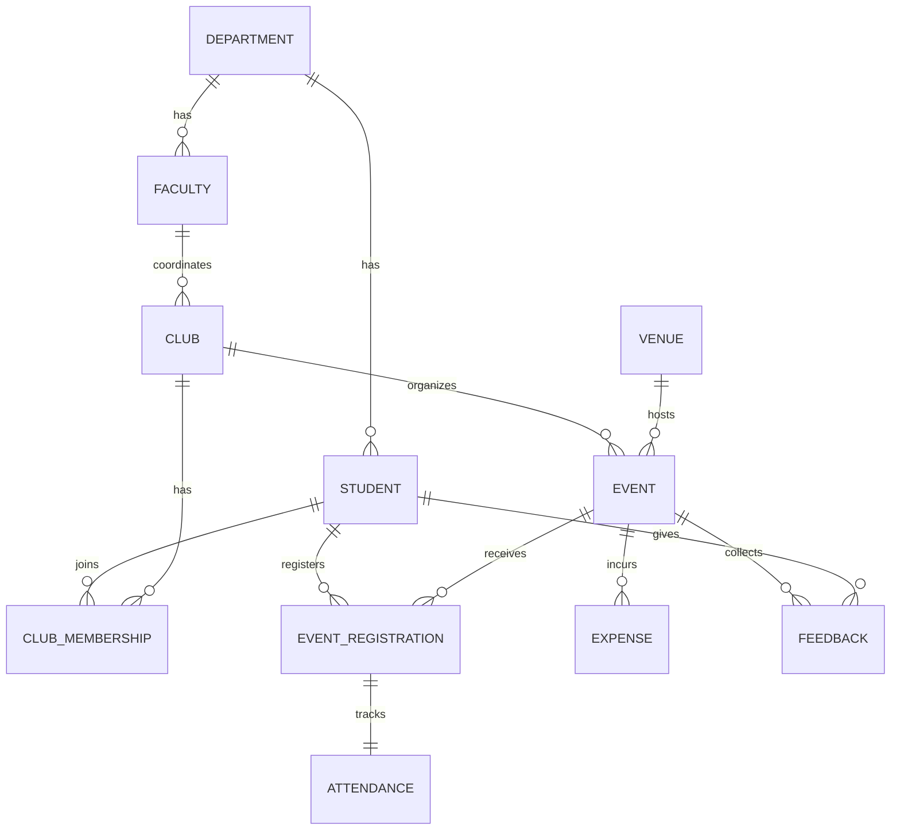

# 🎪 Campus Event & Club Management System

### *One database. Every club, every event, zero chaos.*

[](#)
[](#)
[](#)

---

## 🤔 The Problem

Ask any college club how they manage events, and you'll hear the same story: registrations tracked in a random Google Form, attendance on a paper sheet, budgets in someone's notes app, and feedback that nobody reads twice. Venues get double-booked. Nobody remembers who actually showed up. Expenses quietly blow past the budget.

**This project fixes that with one clean, connected database** — built the proper DBMS way, with rules baked in so bad data literally *can't* get saved.

---

## ✨ What It Actually Does

| 🎯 | Feature |
|---|---|
| 🏛️ | Tracks every **club**, its **faculty coordinator**, and its **members** (with roles like President, Treasurer, etc.) |
| 📅 | Schedules **events** at specific **venues** — with an approval status and a budget ceiling |
| 📝 | Lets students **register** for events and records who actually **attended** |
| 💰 | Logs every **expense** — and the database *automatically rejects* any expense that would blow the budget |
| ⭐ | Collects **feedback & ratings** after each event |
| 🔒 | Enforces every rule above using real constraints, not just "hoping the app remembers to check" |

---

## 👥 The Team

| Name | Registration No. |
|---|---|
| Shreshth Sharma | 25BCE11231 |
| Aryan Singh Patel | 25BCE11138 |
| Krish Salaria | 25BCE11158 |
| Harshvardhan Swami | 25BCE11122 |

**Course:** Database Management Systems (CSE3001) · **Faculty:** Vijendra Singh Bramhe · VIT Bhopal University

---

## 📁 What's in This Repo

| File | What it is |
|---|---|
| 📄 `Campus_Event_Club_Management_System_Report.docx` | The full write-up — objectives, ER diagram, table-by-table breakdown, and how everything was normalized |
| 🗄️ `campus_event_club_management.sql` | The actual database — run it and get a fully working, pre-filled MySQL database in seconds |
| 🧭 `docs/er-diagram.mmd` | Editable Mermaid ER diagram for all entities and relationships |
| 🧪 `tests/constraint_checks.sql` | SQL checks for budget/capacity rules, registration, and automatic attendance |
| 🌐 `index.html`, `styles.css`, `script.js` | Responsive project overview website with repository and deliverable links |
| 📘 `README.md` | You are here |

### 🌐 Project website

The static project overview links to the GitHub repository and the SQL, report, ER diagram, and constraint-check files. It is informational: it does not connect to a database or accept registrations.

**Run locally:** from the repository root, start Python's built-in static web server:

```sh
python -m http.server 8000
```

Then open <http://localhost:8000> in a browser. Stop the server with `Ctrl+C`.

**Publish on GitHub Pages:** in the repository, open **Settings → Pages**. Under **Build and deployment**, select **Deploy from a branch**, choose `shreshthsharma-os-create-dbms-deliverables` as the branch and `/(root)` as the folder, then select **Save**. After GitHub finishes its first deployment, the site will be available at:

<https://shreshthsharma-os.github.io/DBMS_Project_CampusEvent_and_Club_Management_System/>

The repository is public. A Pages URL is only live after Pages has been enabled and its deployment has completed; check the **Settings → Pages** page for deployment status or URL if GitHub has not published it yet.

---

## 🧩 How the Data Fits Together

Think of it as **11 building blocks**, split into two kinds:

- **Core entities** — the "things" in the system: Department, Student, Faculty, Club, Venue, Event, Expense, Feedback, Attendance
- **Connector tables** — quietly link two entities that have a many-to-many relationship (a student can join *many* clubs, and a club has *many* students):
  - `CLUB_MEMBERSHIP` → connects Students ↔ Clubs
  - `EVENT_REGISTRATION` → connects Students ↔ Events


```mermaid
erDiagram
    DEPARTMENT ||--o{ STUDENT : has
    DEPARTMENT ||--o{ FACULTY : has
    FACULTY ||--o{ CLUB : coordinates
    STUDENT ||--o{ CLUB_MEMBERSHIP : joins
    CLUB ||--o{ CLUB_MEMBERSHIP : has
    CLUB ||--o{ EVENT : organizes
    VENUE ||--o{ EVENT : hosts
    STUDENT ||--o{ EVENT_REGISTRATION : registers
    EVENT ||--o{ EVENT_REGISTRATION : receives
    EVENT_REGISTRATION ||--|| ATTENDANCE : tracks
    EVENT ||--o{ EXPENSE : incurs
    EVENT ||--o{ FEEDBACK : collects
    STUDENT ||--o{ FEEDBACK : gives
```

*(GitHub renders this diagram automatically — the full labeled ER diagram with every column is in the report.)*

Every table only stores what actually belongs to it — a student's department is never copy-pasted everywhere, it's just looked up when needed. That's what "**normalized to 3NF**" means in plain English: **no duplicate data, no contradictions, no mess.**

---

## 🧠 The Smart Parts

Anyone can create tables. The interesting part is teaching the *database itself* to enforce the rules:

- 🚫 **Can't overspend** — try to log an expense that pushes a club past its budget, and MySQL rejects it outright. No app-level check needed.
- 🙅 **Can't double-book yourself** — the system won't let the same student register twice for the same event.
- 🪑 **Capacity stays bounded** — event registration stops at the event limit, event capacity cannot exceed venue capacity, and a venue cannot host overlapping events.
- 🤖 **Auto bookkeeping** — the moment a student registers, an attendance record is silently created for them, ready to be marked when they check in.

All of this is done using **triggers**, a **stored procedure**, and **check constraints** — see `campus_event_club_management.sql` for the exact code.

---

## 🚀 Try It Yourself

**You need:** MySQL 8.0+ or MariaDB 10.5+ (nothing else)

```sh
mysql -u root -p < campus_event_club_management.sql
```

The script creates `campus_event_club_db`, its tables, triggers, procedure, view, and sample data. It does not drop or overwrite an existing database. Run it against a fresh database; to rebuild an existing copy, remove that database yourself first. The script requires privileges to create a database, tables, triggers, routines, and views.

### 🔍 Play around

```sql
USE campus_event_club_db;

-- What's coming up?
SELECT * FROM vw_upcoming_events;

-- Which club has the most members?
SELECT club_name, COUNT(*) AS members
FROM CLUB_MEMBERSHIP
JOIN CLUB USING (club_id)
GROUP BY club_name
ORDER BY members DESC;

-- Register a student for an event — safely, with all checks applied
CALL sp_register_for_event(2, 8);
```

### 🧪 Constraint checks

After loading the schema, run the checks in a MySQL/MariaDB client:

```sh
mysql -u root -p < tests/constraint_checks.sql
```

The checks use fixture rows and clean them up. The registration procedure commits its own transaction; its test enrollment is deleted after verification. Expected rejections are caught and checked by SQLSTATE so an unexpectedly successful statement fails the test.

---

## 🔮 Where This Could Go Next

- 🌐 A real front-end (React/Angular) talking to this database over an API
- 🔑 Login system with roles — student, club admin, faculty, university admin
- 📱 QR-code check-ins that update attendance live
- 📧 Auto-emails when a student registers or an event gets approved
- 📊 A dashboard showing which clubs are thriving and where the budget's going

---

<p align="center"><i>Built as a DBMS mini-project to show that good database design isn't just about storing data — it's about making bad data impossible.</i></p>
